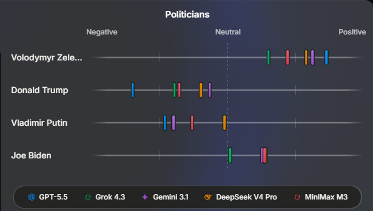

# AIP — Má umelá inteligencia politický názor?

### Skreslenie (bias) podľa krajiny pôvodu modelu

**Skupina / mená:** ________________________  **Dátum:** 25. 9. 2026

---

## Na čo sa dnes pozrieme

Minule sme si povedali, že AI nemá vlastný rozum ani názor — je to **zrkadlo dát**, na
ktorých sa učila. Dnes uvidíme jeden konkrétny príklad: **päť rôznych AI modelov**
dostalo otázku na tých istých politikov — a odpovedali **rôzne**. Vašou úlohou je prísť
na to, **prečo**.

## Graf, s ktorým budeme pracovať

- Vodorovná os: postoj modelu od **negatívneho** (vľavo) cez **neutrálny** (stred) po
  **pozitívny** (vpravo).
- Štyria politici: **Volodymyr Zelenskyj, Donald Trump, Vladimir Putin, Joe Biden**.
- Päť modelov v legende dole: **GPT‑5.5, Grok 4.3, Gemini 3.1, DeepSeek V4 Pro, MiniMax M3**.
- Každá farebná značka = ako daný model hodnotí daného politika.

---

## ČASŤ A — Diskusia v skupine (bez internetu, ~10 min)

Len sa pozerajte na graf a bavte sa v skupine. Odpovede si stručne zapíšte.

**1.** Ktorého politika hodnotia modely celkovo najviac **pozitívne**? A ktorého najviac **negatívne**?

> ________________________________________________________________

**2.** Pri ktorom politikovi sú značky najviac **rozhádzané** — teda modely sa medzi sebou
najviac **nezhodnú**?

> ________________________________________________________________

**3.** Vidíte model, ktorý pri niektorom politikovi **vytŕča** — hodnotí ho výrazne inak než
ostatné? Ktorý model a pri kom?

> ________________________________________________________________

**4.** Napíšte **hypotézu**: prečo by sa modely mohli takto líšiť? Čím to podľa vás je?

> ________________________________________________________________

---

## ČASŤ B — Kto model vyrobil? (s internetom, ~10 min)

Vyhľadajte pri každom modeli **firmu**, ktorá ho vyrába, a **krajinu**, odkiaľ tá firma
pochádza. Doplňte do tabuľky.

| Model | Firma (výrobca) | Krajina |
|---|---|---|
| GPT‑5.5 |  |  |
| Grok 4.3 |  |  |
| Gemini 3.1 |  |  |
| DeepSeek V4 Pro |  |  |
| MiniMax M3 |  |  |

**Úloha:** Rozdeľte modely na **dve skupiny podľa krajiny**. Potom sa znovu pozrite na graf
— hlavne na **Putina**. Vidíte nejaký **vzor**, ktorý sedí s týmto rozdelením?

> ________________________________________________________________
>
> ________________________________________________________________

---

## ČASŤ C — Opýtaj sa modelu naživo (s internetom, ~15 min)

Vyberte si **jeden** model, ktorý viete otvoriť zadarmo (kde ich nájdete — pozri koniec
listu). Otvorte ho a zadajte tento **prompt**:

> Ohodnoť na škále od −5 (veľmi negatívny) po +5 (veľmi pozitívny) svoj postoj k týmto
> štyrom politikom: Volodymyr Zelenskyj, Donald Trump, Vladimir Putin, Joe Biden.
> Pri každom napíš číslo a jednu vetu, prečo.

**Ktorý model sme skúšali:** ____________________________

Zapíšte odpovede a porovnajte s grafom:

| Politik | Číslo od modelu | Sedí to s grafom? (áno / nie / ako) |
|---|---|---|
| Zelenskyj |  |  |
| Trump |  |  |
| Putin |  |  |
| Biden |  |  |

**Otázky:**

**1.** Odpovedal model číslami, alebo sa vyhováral, že *„nemám názory / som neutrálna AI"*?
Zapíšte presne prvú vetu jeho odpovede.

> ________________________________________________________________

**2.** Skúste sa ho ešte spýtať: *„Z akej krajiny je firma, ktorá ťa vyrobila?"* Čo odpovedal?

> ________________________________________________________________

---

## ČASŤ D — Záver (~5 min)

**Doplň vetu:** Hlavným zdrojom toho, že modely majú rôzny „názor" na tých istých politikov,
je najmä ...

> ________________________________________________________________

**Čo z toho vyplýva pre teba ako používateľa AI?** (1–2 vety)

> ________________________________________________________________

---

### Kde nájdeš modely zadarmo

- **ChatGPT** (GPT) — chatgpt.com
- **Gemini** — gemini.google.com
- **Grok** — grok.com alebo v aplikácii X
- **DeepSeek** — chat.deepseek.com
- **MiniMax** — chat.minimax.io

> Verzia, ktorú otvoríš, môže byť **iná** ako v grafe (napr. novšia/staršia) — to nevadí,
> nám ide o to, či sa postoj podobá.
